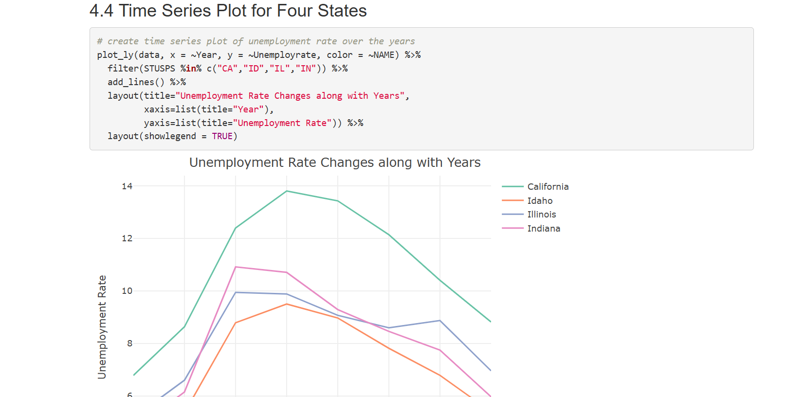
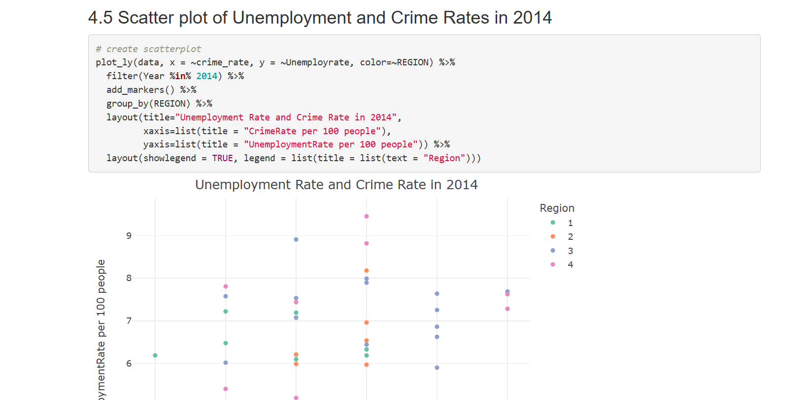

# Exploring the Relationship Between Unemployment and Crime Rates

## Description

This report describes the process I performed on crime and unemployment data along with the visualizations and insights I made from the data. Using crime rates and unemployment rates from states in the United States, I answered the question, 'what kind of a relationship is there between unemployemnt and crime rates?' After performing exploratory data analysis, I determined that there is a mild/weak positive correlation between crime rates and unemployment rates, indicating some relationship between the two variables. However, I conclude that there are other factors also influencing these variables that can be explored in the future.

## Screenshots

## Website
[https://emilyk221.github.io/crime-unemployment-relationship/](https://emilyk221.github.io/crime-unemployment-relationship/)
